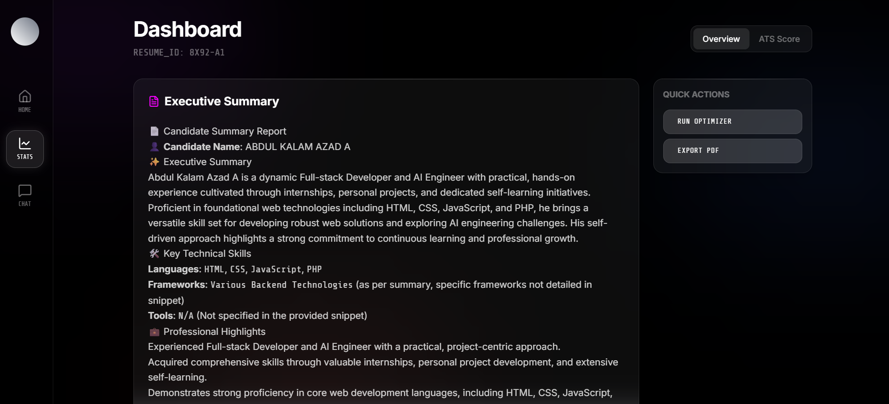
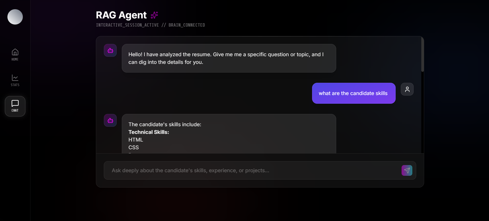
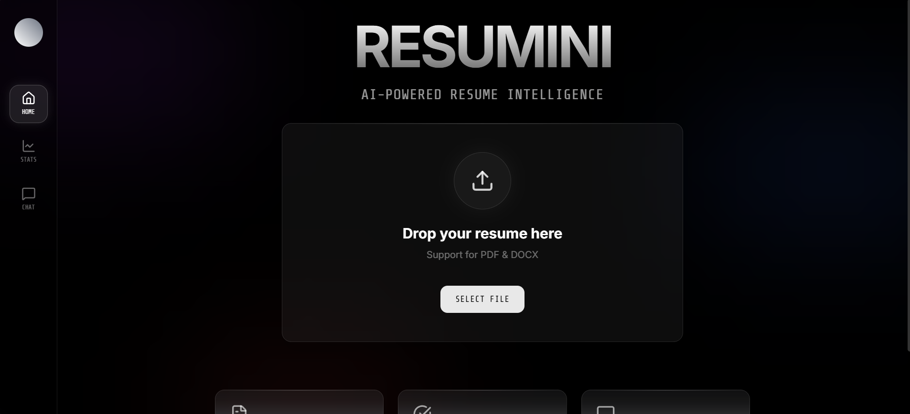

# Resume Intelligence Analysis Application

Resumini is a powerful Resume Intelligence Analysis Application designed to help candidates optimize their resumes. It leverages Google's Gemini models (via `google-adk`), FastAPI, and a modern React frontend to analyze, summarize, score, and rewrite resumes.

## Application Screenshots

### 1. Dashboard & Executive Summary

The dashboard provides an instant, AI-generated executive summary of the candidate's profile. It highlights key skills, professional achievements, and education in a structured, easy-to-read format.



### 2. Smart ATS Analysis

Get a detailed breakdown of how well the resume matches a specific job role. The system analyzes keywords, structure, and content, providing a match score and actionable AI feedback to improve the resume.


### 3. Interactive RAG Chat Agent

Chat with your resume! The RAG (Retrieval-Augmented Generation) agent allows you to ask deep questions about the candidate's experience. It supports rich Markdown responses, including tables and code blocks, in a premium conversational interface.



### 4. Resume Upload & Home

A clean, modern interface for uploading resumes (PDF, DOCX, TXT). The system automatically parses the file and prepares it for analysis.



## Tech Stack

- **Backend**: Python 3.10+, FastAPI, Google Vertex AI (Gemini), LangChain
- **Frontend**: React, Vite, TailwindCSS, Lucide Icons, Framer Motion, React Markdown
- **Infrastructure**: Uvicorn, Docker (optional)

## Features

- **resumini-parser**: Extract text from PDF, DOCX, and plain text files.
- **RAG Agent (Interactive Chat)**: Chat with your resume using a premium, glassmorphic UI. Supports rich Markdown responses (tables, code blocks) and maintains context.
- **Smart ATS Analysis**: Comprehensive keyword matching (50+ tech terms) and AI-driven feedback comparison against job descriptions.
- **Rich Summary Generation**: Produces beautiful, structured Markdown summaries with emojis and clear sections (Executive Summary, Skills, Highlights).
- **Resume Optimization**: Rewrite resume content to better align with a specific job role.
- **Job Search**: Search for relevant jobs on LinkedIn (requires Chrome/Selenium).

## Prerequisites

- Python 3.10+
- Node.js & npm (for Frontend)
- [Google Cloud Project](https://console.cloud.google.com/) with Vertex AI enabled.

## Installation & Setup

Clone the repository:

```bash
git clone <repository-url>
cd GSOC
```

### 1. Backend Setup

Navigate to the backend directory:

```bash
cd backend
```

Install dependencies using `uv` (recommended) or `pip`:

```bash
# Using uv
uv sync

# Using pip
pip install -r requirements.txt
```

**Configuration**:
Ensure you have a `.env` file with your Google Cloud credentials (API keys) or set up Application Default Credentials.

Start the Backend Server:

```bash
uv run uvicorn app.main:app --reload
```

The API will run at `http://127.0.0.1:8000`.

### 2. Frontend Setup

Navigate to the frontend directory:

```bash
cd ../frontend
```

Install dependencies:

```bash
npm install
```

Start the Development Server:

```bash
npm run dev
```

The Frontend will run at `http://localhost:5173` (default Vite port).

## Project Structure

- `backend/`
  - `app/`: Core application logic (API, Services, Models).
  - `tests/`: specific test scripts.
  - `requirements.txt`: Python dependencies.
- `frontend/`
  - `src/`: React source code (Components, Pages).
  - `vite.config.ts`: Vite configuration.
  - `package.json`: Node dependencies.

## API Documentation

- **Swagger UI**: Visit `http://127.0.0.1:8000/docs`.
- **Detailed Docs**: See [backend/API_DOCUMENTATION.md](backend/API_DOCUMENTATION.md).

## To get a understanding of this project See the CLI VERSION OF THIS PROTOTYPE

https://www.linkedin.com/embed/feed/update/urn:li:ugcPost:7390056237523959808
